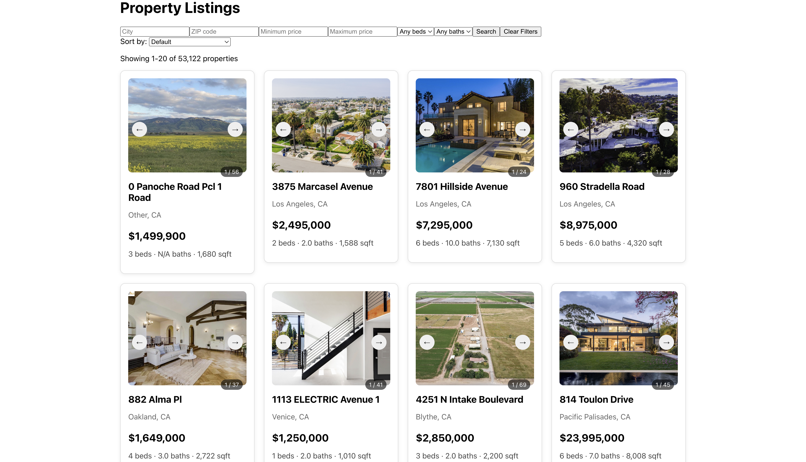

# IDX Exchange Property Search

A full-stack real estate property search application built with React, Express, and MySQL.

The application allows users to browse property listings, filter and sort properties, navigate through paginated results, view detailed property information and photos, and check scheduled open houses.

---

## Features

- Browse real estate property listings
- Filter properties by:
  - City
  - ZIP code
  - Minimum price
  - Maximum price
  - Minimum bedrooms
  - Minimum bathrooms
- Sort property results by:
  - Price
  - Listing date
  - Square footage
  - Bedrooms
- Paginate through large property datasets
- View detailed property information
- Browse property photos with an image carousel
- View scheduled open houses
- Handle missing or invalid property photos
- Backend request validation and error handling
- Automated frontend and backend tests

---

## Tech Stack

### Frontend

- React 19.2.7
- React DOM 19.2.7
- React Router DOM 6.30.4
- React Scripts 5.0.1
- JavaScript
- CSS
- React Testing Library 16.3.2
- Jest DOM 6.9.1

### Backend

- Node.js
- Express 5.2.1
- MySQL 8
- mysql2 3.22.5
- CORS 2.8.6
- dotenv 17.4.2
- Jest 30.5.0
- Supertest 7.2.2
- Nodemon 3.1.14

---

## Architecture

The application uses a client-server architecture.

```text
React Frontend
      |
      | HTTP / JSON
      v
Express REST API
      |
      | Parameterized SQL Queries
      v
MySQL Database
```

During local development:

```text
Frontend: http://localhost:3000
Backend:  http://localhost:5000
```

The React frontend sends HTTP requests to the Express API. The backend validates request parameters, queries MySQL, and returns JSON responses to the frontend.

---

## Project Structure

```text
IDX-Exchange-Property-Search/
│
├── backend/
│   ├── routes/
│   │   ├── properties.js
│   │   └── properties.test.js
│   ├── db.js
│   ├── server.js
│   ├── package.json
│   └── .env
│
├── frontend/
│   ├── src/
│   │   ├── api/
│   │   │   ├── client.js
│   │   │   └── client.test.js
│   │   │
│   │   ├── components/
│   │   │   ├── ErrorBoundary.js
│   │   │   ├── Pagination.js
│   │   │   ├── Pagination.test.js
│   │   │   ├── PropertyCard.js
│   │   │   ├── PropertyCard.test.js
│   │   │   ├── PropertyFilters.js
│   │   │   └── PropertyFilters.test.js
│   │   │
│   │   ├── hooks/
│   │   │   └── usePropertyDetails.js
│   │   │
│   │   ├── pages/
│   │   │   ├── ListingsPage.js
│   │   │   └── PropertyDetailPage.js
│   │   │
│   │   ├── utils/
│   │   │   └── propertyUtils.js
│   │   │
│   │   ├── App.js
│   │   └── App.test.js
│   │
│   └── package.json
│
├── docs/
│   └── screenshots/
│
└── README.md
```

---

## Prerequisites

Before running the project locally, install:

- Node.js
- npm
- MySQL 8
- Git

You also need access to the property and open-house datasets used by the application.

---

# Local Setup

## 1. Clone the Repository

```bash
git clone https://github.com/JamesDrQ/IDX-Exchange-Property-Search.git
cd IDX-Exchange-Property-Search
```

---

## 2. Install Backend Dependencies

```bash
cd backend
npm install
```

---

## 3. Configure Environment Variables

Create a `.env` file inside the `backend` directory.

```env
DB_HOST=localhost
DB_USER=your_mysql_username
DB_PASSWORD=your_mysql_password
DB_NAME=your_database_name
DB_PORT=3306
PORT=5000
```

Replace the placeholder values with your local MySQL configuration.

The backend database pool reads the following variables:

| Variable | Description |
|---|---|
| `DB_HOST` | MySQL server hostname |
| `DB_USER` | MySQL username |
| `DB_PASSWORD` | MySQL password |
| `DB_NAME` | Database containing the property tables |
| `DB_PORT` | MySQL port, defaults to `3306` |
| `PORT` | Express server port |

For local development, use:

```env
PORT=5000
```

because the frontend is configured to communicate with:

```text
http://localhost:5000
```

Do not commit the `.env` file or database credentials to Git.

---

## 4. Prepare the MySQL Database

Import the property datasets into your MySQL database.

The application primarily uses two tables:

```text
rets_property
rets_openhouse
```

After importing the data, verify that the tables exist:

```sql
SHOW TABLES;
```

You should see both:

```text
rets_property
rets_openhouse
```

You can also verify that property records were imported:

```sql
SELECT COUNT(*)
FROM rets_property;
```

and open-house records:

```sql
SELECT COUNT(*)
FROM rets_openhouse;
```

Make sure the database name matches the value configured in:

```env
DB_NAME=your_database_name
```

---

## 5. Start the Backend

From the `backend` directory:

```bash
npm start
```

For development with automatic restart:

```bash
npm run dev
```

The backend should run at:

```text
http://localhost:5000
```

To verify that the backend and database connection are working, open:

```text
http://localhost:5000/api/health
```

A successful response looks like:

```json
{
  "status": "ok",
  "database": "connected"
}
```

---

## 6. Install Frontend Dependencies

Open another terminal and navigate to the frontend directory:

```bash
cd frontend
npm install
```

---

## 7. Start the Frontend

```bash
npm start
```

The application should open at:

```text
http://localhost:3000
```

The frontend is configured to communicate with the backend running on port `5000`.

---

# API Reference

## Health Check

### `GET /api/health`

Checks whether the backend and MySQL database connection are available.

### Example Request

```http
GET /api/health
```

### Example Response

```json
{
  "status": "ok",
  "database": "connected"
}
```

If the database is unavailable, the endpoint returns HTTP `500`.

---

# Get Properties

### `GET /api/properties`

Returns a paginated list of property listings.

## Query Parameters

| Parameter | Description | Default |
|---|---|---|
| `city` | Filter by city | None |
| `zipcode` | Filter by ZIP code | None |
| `minPrice` | Minimum listing price | None |
| `maxPrice` | Maximum listing price | None |
| `beds` | Minimum number of bedrooms | None |
| `baths` | Minimum number of bathrooms | None |
| `sortBy` | Field used to sort results | `L_DisplayId` |
| `sortOrder` | `asc` or `desc` | `asc` |
| `limit` | Number of properties per request | `20` |
| `offset` | Number of matching rows to skip | `0` |

`limit` must be between `1` and `100`.

---

## Supported Sorting Fields

The following values are accepted for `sortBy`:

```text
L_SystemPrice
ListingContractDate
LM_Int2_3
L_Keyword2
```

Examples:

```http
GET /api/properties?sortBy=L_SystemPrice&sortOrder=asc
```

```http
GET /api/properties?sortBy=ListingContractDate&sortOrder=desc
```

---

## Example Property Search

```http
GET /api/properties?city=San%20Diego&minPrice=500000&beds=3&limit=20&offset=0
```

Example response:

```json
{
  "total": 2150,
  "limit": 20,
  "offset": 0,
  "results": [
    {
      "L_DisplayId": "123456789",
      "L_Address": "123 Example Street",
      "L_City": "San Diego",
      "L_State": "CA",
      "L_Zip": "92101",
      "L_SystemPrice": 750000,
      "bedrooms": 3,
      "bathrooms": 2,
      "sqft": 1500
    }
  ]
}
```

The `total` field contains the total number of listings matching the filters, while `results` contains only the requested page.

---

## Validation

Invalid query parameters return HTTP `400`.

Examples include:

```text
limit=0
limit=101
limit=abc
offset=-1
minPrice=-1
maxPrice=abc
beds=-1
baths=1.5
minPrice greater than maxPrice
invalid sortBy
invalid sortOrder
empty city
empty zipcode
```

Example:

```http
GET /api/properties?limit=0
```

Response:

```json
{
  "error": "limit must be an integer between 1 and 100"
}
```

---

# Get Property Details

### `GET /api/properties/:id`

Returns the complete record for one property using its listing ID.

### Example Request

```http
GET /api/properties/1174572339
```

### Example Response

```json
{
  "L_ListingID": "1174572339",
  "L_DisplayId": "1174572339",
  "L_Address": "2003 Lynbrook Avenue",
  "L_City": "Hacienda Heights",
  "L_State": "CA",
  "L_Zip": "91745",
  "L_SystemPrice": 950000,
  "L_Keyword2": 5,
  "LM_Dec_3": 3,
  "LM_Int2_3": 1812
}
```

### Possible Responses

| Status | Meaning |
|---|---|
| `200` | Property found |
| `400` | Invalid property ID |
| `404` | Property not found |
| `500` | Internal server error |

---

# Get Open Houses

### `GET /api/properties/:id/openhouses`

Returns scheduled open houses for a property.

The backend first verifies that the property exists and then retrieves its open-house records.

### Example Request

```http
GET /api/properties/1174572339/openhouses
```

### Example Response

```json
[
  {
    "L_ListingID": "1174572339",
    "OpenHouseDate": "2026-06-20",
    "OH_StartTime": "14:00:00",
    "OH_EndTime": "16:00:00"
  }
]
```

If the property exists but currently has no open houses:

```json
[]
```

If the property does not exist:

```json
{
  "error": "Property not found"
}
```

with HTTP status `404`.

---

# Database Schema

## `rets_property`

The `rets_property` table stores real estate listing information.

Important columns include:

| Column | Description |
|---|---|
| `L_ListingID` | Listing identifier used by backend detail queries |
| `L_DisplayId` | Listing identifier displayed and used by the frontend |
| `L_Address` | Street address |
| `L_City` | City |
| `L_State` | State |
| `L_Zip` | ZIP code |
| `L_SystemPrice` | Listing price |
| `L_Keyword2` | Number of bedrooms |
| `LM_Dec_3` | Number of bathrooms |
| `LM_Int2_3` | Square footage |
| `L_Photos` | Property photo information stored as JSON data |
| `ListingContractDate` | Listing contract date |
| `BathroomsHalf` | Number of half bathrooms |
| `MainLevelBedrooms` | Main-level bedroom information |

---

## `rets_openhouse`

The `rets_openhouse` table stores open-house records.

Important columns include:

| Column | Description |
|---|---|
| `L_ListingID` | Property listing identifier |
| `L_DisplayId` | Display listing identifier |
| `OpenHouseDate` | Date of the open house |
| `OH_StartTime` | Open-house start time |
| `OH_EndTime` | Open-house end time |

---

## Table Relationship

The two tables are connected through `L_ListingID`.

```text
rets_property
     |
     | L_ListingID
     |
     +--------------------+
                          |
                          v
                    rets_openhouse
```

One property can have:

```text
0..n open-house records
```

This means a property may have no scheduled open houses, one open house, or multiple open-house events.

---

# Testing

The project contains automated frontend and backend tests.

---

## Backend Testing

Backend tests use:

- Jest
- Supertest
- Mocked MySQL connection pool

The database is mocked during tests, so a live MySQL database is not required to run the API unit/integration tests.

Run all backend tests:

```bash
cd backend
npm test
```

Run backend tests with coverage:

```bash
npm run test:coverage
```

Backend tests currently cover:

- Successful property retrieval
- Pagination
- City filtering
- ZIP-code filtering
- Price filtering
- Bedroom filtering
- Bathroom filtering
- Sorting
- Query parameter validation
- Property detail retrieval
- Invalid property IDs
- Missing properties
- Open-house retrieval
- Properties with no open houses
- Missing properties when requesting open houses

Current backend test result:

```text
24 tests passed
```

Coverage for `routes/properties.js`:

```text
Statements: 93.4%
Branches:   98.78%
Functions:  100%
Lines:      93.4%
```

---

## Frontend Testing

Frontend tests use:

- Jest
- React Testing Library

Run frontend tests once:

```bash
cd frontend
npm test -- --watchAll=false
```

Run frontend tests with coverage:

```bash
npm test -- --coverage --watchAll=false
```

Critical frontend components tested include:

### `PropertyFilters`

Tests cover:

- Rendering filter inputs
- User input
- Search behavior
- Clear/reset behavior

Current line coverage:

```text
100%
```

### `Pagination`

Tests cover:

- Page navigation
- Previous/next controls
- Disabled states
- Page-number buttons
- Ellipsis behavior
- Hiding pagination when only one page exists

Current line coverage:

```text
100%
```

### `PropertyCard`

Tests cover:

- Property data rendering
- Navigation to the property detail page
- Property image rendering
- Previous-photo navigation
- Next-photo navigation
- Carousel wraparound behavior
- Image-loading error fallback

Current coverage:

```text
Statements: 95.23%
Branches:   69.23%
Functions:  100%
Lines:      95.23%
```

---

# Error Handling

The backend validates user input before executing database queries.

Invalid values are rejected with HTTP `400`.

Examples include:

- Invalid pagination values
- Negative prices
- Invalid bedroom or bathroom values
- Minimum price greater than maximum price
- Unsupported sorting fields
- Unsupported sorting directions
- Empty city or ZIP-code filters
- Invalid property IDs

Unknown properties return HTTP `404`.

Unexpected database or server errors return HTTP `500`.

---

# Security

Several measures are used to reduce common backend security risks.

## Parameterized Queries

User-provided filter values are passed to MySQL through parameterized queries instead of being directly concatenated into SQL strings.

For example, property filters use SQL placeholders such as:

```sql
L_SystemPrice >= ?
```

with the corresponding user value supplied separately.

This reduces SQL injection risk.

## Sorting Whitelist

SQL column names cannot be safely passed through normal query placeholders, so sorting fields are restricted to a predefined whitelist.

Only approved fields can be used in `ORDER BY`.

## Environment Variables

Database credentials are stored in environment variables instead of being hard-coded into the application.

The `.env` file should never be committed to the repository.

---

# Pagination

The API uses `limit` and `offset` pagination.

For example:

```http
GET /api/properties?limit=20&offset=0
```

returns the first 20 matching properties.

```http
GET /api/properties?limit=20&offset=20
```

returns the next 20.

The frontend converts its page number into the offset expected by the backend.

For a page size of 20:

```text
Page 1 -> offset 0
Page 2 -> offset 20
Page 3 -> offset 40
```

---

# Property Photos

Property photo information is stored in the MLS data as JSON.

`PropertyCard` parses the photo data before rendering it.

When multiple photos are available, users can navigate between them using previous and next controls.

The carousel wraps around:

```text
First photo + Previous -> Last photo
Last photo + Next      -> First photo
```

If a listing has no usable photo or the image fails to load, the frontend displays:

```text
No photo available
```

---

# Screenshots

Create a screenshots directory if it does not already exist:

```bash
mkdir -p docs/screenshots
```

Place a screenshot of the running listings page at:

```text
docs/screenshots/property-listings.png
```

The image will then appear here:



Additional screenshots can optionally be added for:

- Property filters
- Property detail page
- Photo carousel
- Open-house information

---

# Known Limitations

- The application currently depends on a locally available MLS-derived dataset.
- The dataset must be imported manually before the backend can access property data.
- Some property records may contain missing or inconsistent MLS fields.
- Some listings do not contain usable property photos.
- Open-house information is only available when matching records exist in `rets_openhouse`.
- The application currently focuses on local development and demonstration rather than production deployment.
- User accounts and authentication are not currently implemented.
- Properties cannot currently be saved to a favorites list.

---

# Future Improvements

Potential future improvements include:

- Production deployment
- Cloud-hosted database
- User authentication
- Saved/favorite properties
- Map-based property search
- Additional property filters
- More advanced search and ranking
- Improved mobile responsiveness
- Better handling of incomplete MLS data
- Additional automated tests
- API caching
- Database query optimization
- Property comparison tools
- Search history
- Improved loading states and user feedback

---

# Running a Complete Verification

After installation and configuration, the project can be verified using the following workflow.

## Backend

```bash
cd backend
npm test
npm run test:coverage
npm start
```

Verify:

```text
http://localhost:5000/api/health
```

---

## Frontend

In another terminal:

```bash
cd frontend
npm test -- --watchAll=false
npm test -- --coverage --watchAll=false
npm start
```

Then open:

```text
http://localhost:3000
```

Verify that you can:

1. View property listings.
2. Search using filters.
3. Clear filters.
4. Navigate between result pages.
5. Sort property results.
6. Open a property detail page.
7. Navigate through property photos.
8. View open-house information when available.

---

# License

This project is currently intended for educational and internship development purposes.
